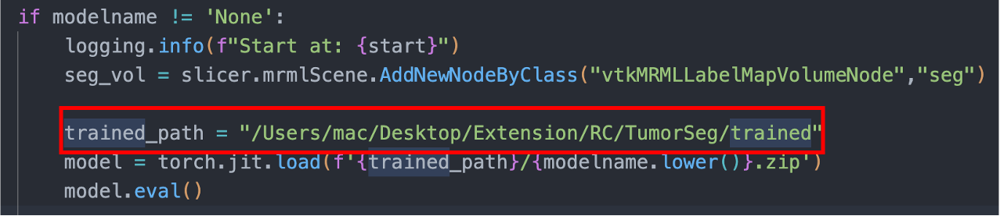

# 3D Slicer: An Extension for Brain Tumor Segmentaion.

[[Github]](https://github.com/RC-Sho0/Brain-Tumor-Segmentaion-on-3D-Slicer/)

[[Demo]](https://www.youtube.com/watch?v=GyhCeiEjsKw)

## Introduction

In my graduate thesis we was proposed 2 methode for 3D Brain Tumor Segmentation(BTS) problem. 

- 3D Dual-Domain Attention Network: We was develop a module using Attention Mechanism can combine 2 level information of the feature… [Read more](https://www.sowwn.dev/pub-dualdomain)
- 3D Dual-Fusion Attention Network: We introduce a new way of fusion 2 trained model for BTS. Using fusion method, Self-Attention and Residual Learning. [Read more](https://www.sowwn.dev/pub-fusionbrainseg)

## Demo Application

My app is an Extension of [3D Slicer](https://www.slicer.org/). 

## How to install.

1. Clone this repository and download the trained model.
   - Clone repository
    
    ```bash
     ~ git clone https://github.com/RC-Sho0/Brain-Tumor-Segmentaion-on-3D-Slicer.git
    ```
  - Download the trained model [here](https://1drv.ms/f/s!ArlplJhiPYx6gj2mHxkUZl7HWs1z?e=UGHIQ4).
    
3. Import independent python module
    - Open Python Console
    
    ```python
    >>> import pip
    >>> pip.main(['install', 'torch', 'monai[nibabel]'])
    ```
    
4. Add trained module into Extension.
    - Copy the path of the trained folder
    - Replace the path at the **“trained_path”** variable in the file TumorSeg.py
        
        
        
5. Import module:
    - Modules —>  Developer Tools —> Extension Wizard
    - Select Extension —> Choose clone folder —> Open
    - **Now you can see my Extension in the Module list** 
      


---

## How to use:

[https://www.youtube.com/watch?v=GyhCeiEjsKw&t=62s](https://www.youtube.com/watch?v=GyhCeiEjsKw&t=62s)

---

If you like that, please Star my repo 🌟 And if you want to support let's follow my GitHub 🎆

***Authorized by [Sho0](https://sonvth.vercel.app/about)***

***Update 26/04/23***

**Feel free to contact me [here](hoangson.vothanh@gmail.com) if you have any questions**
